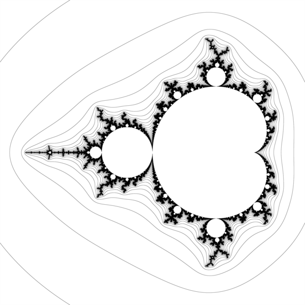
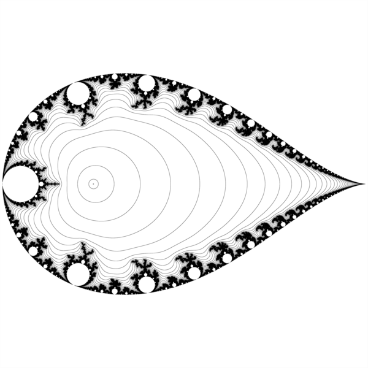
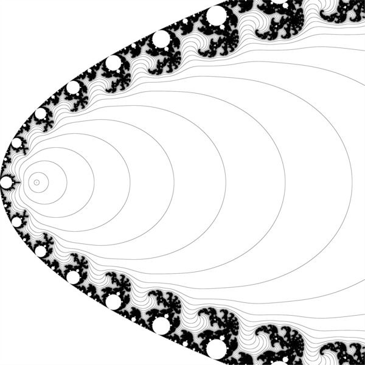
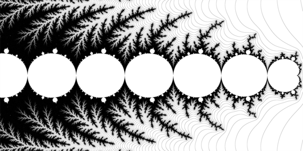
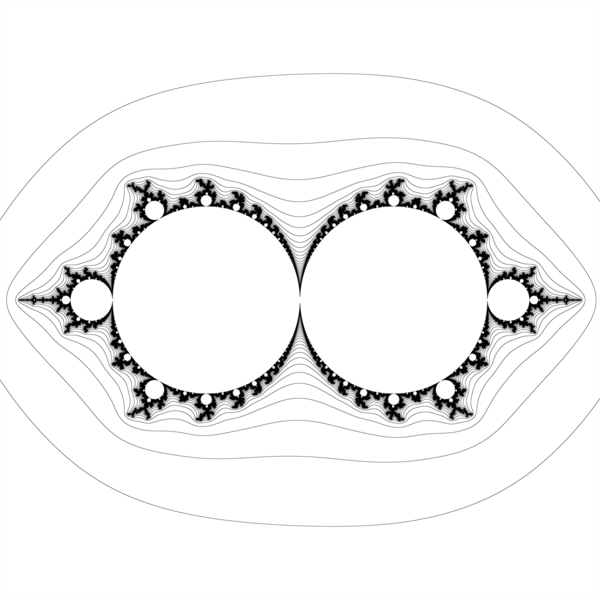
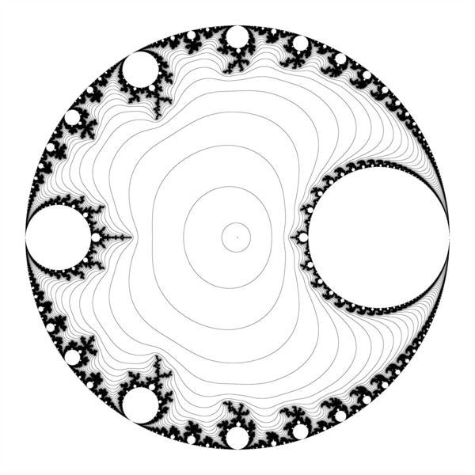
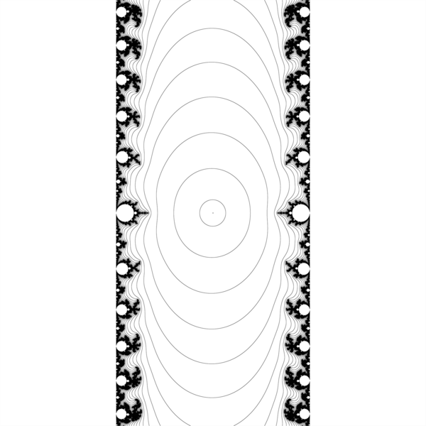

# Mandelbrot-Sets-Alternate-Parameter-Planes


[Julia and Mandelbrot Sets. Alternate Parameter Planes by David E. Joyce © 1994.](https://mathcs.clarku.edu/~djoyce/julia/altplane.html)


Images of [complex quadratic polynomials](https://en.wikipedia.org/wiki/Complex_quadratic_polynomial)


## z^2+c family

Here initial parameter p is transformed:   


    c = t(p)
    
So the whole plane (more precisely  rectangle viewport) is transformed. For example for c_exponnetial 

```
	plane before transformation 
xMin  = -8.9000000000000004 	 xMax = 0.7000000000000000 
yMin  = -2.3999999999999999 	 yMax = 2.3999999999999999 
	plane after transformation 
xMin  = -1.4010186110735179 	 xMax = 0.6125977074704767 
yMin  = -0.6754631805511510 	 yMax = 0.6754631805511510 
```
    
    
###  z^2 + c

First example is simple: c = p

  


Description by  [David E. Joyce](https://mathcs.clarku.edu/~djoyce/julia/altplane.html)  
>  the most notable feature of the set is a cardioid 

### z^2 + (k +1/p)

Here 

c = k + 1/p

translation is performed before the inversion


####  z^2 + 1/p

Second example is [simple inversion](https://mathworld.wolfram.com/Inversion.html). Here c = 1/p ( and k = 0 so no translation , simply inversion about a init circle centered at origin  )

  



Description by  [Nikola Ubavić](https://ubavic.rs/work/julia_and_mandelbrot_set/?lang=sr)  
> composition of the inversion with respect to the unit circle centered at zero, and the conjugation (axial symmetry with respect to the real line). 
> The cardioid from the boundary of the Mandelbrot set in the "standard" parameterization corresponds to the tear-shaped curve in the 1/c parameterization.


> The inverse of the cardioid is the exterior of a teardrop shape. The circles on the outside of the cardioid are inverted to circles on the inside of the teardrop. The cusp of the cardioid becomes the cusp of the teardrop.


#### z^2 -2.0+1.0/p

Here : c =  -2.0+1.0/p ( and k = -2)


####  z^2 + 0.25+1.0/p

Here: c =  0.25 + 1.0/p ( and k = 0.25)


  
  


Description by  [Nikola Ubavić](https://ubavic.rs/work/julia_and_mandelbrot_set/?lang=sr)  
> If a 1/4 translation is performed before the inversion, then the cardioid is imaged in a parabola.


> The cusp of the cardioid is then moved to the origin, and that inverts to infinity. 
> the cardioid is sent to the outside of a parabola. 
> The circles on the outside of the cardioid are inverted to circles on the inside of the parabola.


#### z^2 -1.401155 - 1.0/p

Here: c =  -1.401155 - 1.0/p

  


### Exponential map

Here : c = cf + e^p

where 
* cf is the Feigenbaum point -1.401155 = Accumulation point of period-doubling


[Period doubling cascade](https://en.wikibooks.org/wiki/Fractals/Iterations_in_the_complex_plane/1over2_family): 
* one can see 7 hyperbolic components  for periods 2^0, 2^1, 2^2, 2^3, 2^4, 2^5, 2^6
* note that each componnet has tha same size 
   



## m*z*(z-1) = logistic family


  m*z*(1.0-z)
  
so here m = p  
  
  



  z*(1.0-z)/p
  
here m = 1/p




  (1 + 1/p)*z*(1.0-z)
  
here m = 1 + 1/p


  


Compare
* [changing the inversion offset for the lambda plane mandelbrot by https://www.youtube.com/channel/UCdOI0EQgdwiRbIafRkd8SHw](https://www.youtube.com/watch?v=Xob9xZ2dBIs). Here m = k + 1/p where k is changing from 0 to 2 


# To do
* [Mercator Mandelbrot Maps by: Anders Sandberg](https://www.flickr.com/photos/arenamontanus/albums/72157615740829949) : a logarithmic projection around a point c0: z-> (log(|z-c0|), arg(z-c0)). The idea for this kind of logarithmic map of the set is from [David Madore](http://www.madore.org/~david/math/mandelbrot.html). While it is a bit of a stretch to call it a Mercator projection, it sounds better than just a log scale map. If the Mandelbrot set is assumed to be about meter-sized these zooms reach the size of an atomic nucleus.  
* transverse Mercator
  * [The North Transept Transfigurational Dreamwarp by Robert Lee](https://www.flickr.com/photos/robertlee99/50289710431/) : 


# Git

create a new repository on the command line

```git
echo "# Mandelbrot-Sets-Alternate-Parameter-Planes" >> README.md
git init
git add README.md
git commit -m "first commit"
git branch -M main
git remote add origin git@github.com:adammaj1/Mandelbrot-Sets-Alternate-Parameter-Planes.git
git push -u origin main
```


## Local repo
```
~/Dokumenty/mandelbrot_planes$ 
```


## Subdirectory

```git
mkdir png
git add *.png
git mv  *.png ./png
git commit -m "move"
git push -u origin main
```
then link the images:

```txt
 

```

```git
gitm mv -f 
```

[Remove a file/directory from a Git repository without deleting it from the local filesystem](https://stackoverflow.com/questions/1143796/remove-a-file-from-a-git-repository-without-deleting-it-from-the-local-filesyste)

```git
git rm --cached myfile.log
```

Single directory and all it's content

```git
git rm --cached -r ./png
git commit -m "png"
git push -u origin main

```


Rename directory

```git
git add ./lcm/
git mv ./lcm ./png 
git commit -m "png"
git push -u origin main

```

## Github
* [GitHub Flavored Markdown Spec](https://github.github.com/gfm/)
