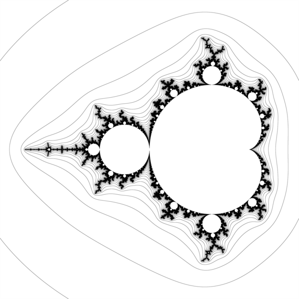
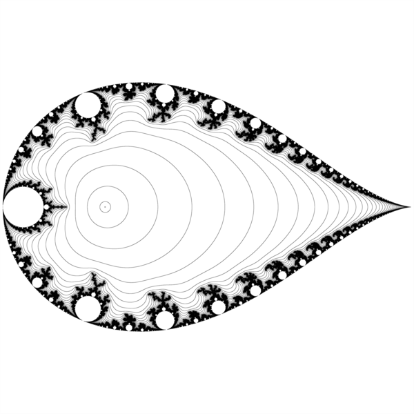
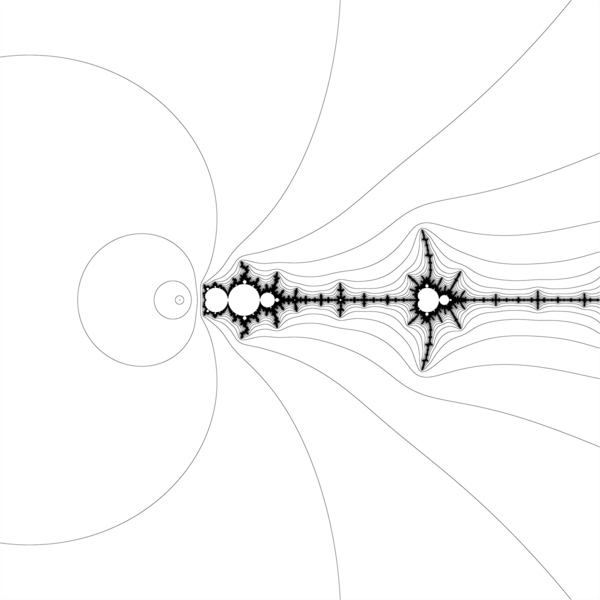

# Mandelbrot-Sets-Alternate-Parameter-Planes


[Julia and Mandelbrot Sets. Alternate Parameter Planes by David E. Joyce © 1994.](https://mathcs.clarku.edu/~djoyce/julia/altplane.html)


Images of [complex quadratic polynomials](https://en.wikipedia.org/wiki/Complex_quadratic_polynomial)


## z^2+p family

   z^2 + c





  z^2 + 1/c
  



  z^2 -2.0 + 1.0/c





## p*z*(z-1) logistic family


# Git

create a new repository on the command line

```git
echo "# Mandelbrot-Sets-Alternate-Parameter-Planes" >> README.md
git init
git add README.md
git commit -m "first commit"
git branch -M main
git remote add origin git@github.com:adammaj1/Mandelbrot-Sets-Alternate-Parameter-Planes.git
git push -u origin main
```


## Local repo
```
~/Dokumenty/mandelbrot_planes$ 
```


## Subdirectory

```git
mkdir png
git add *.png
git mv  *.png ./png
git commit -m "move"
git push -u origin main
```
then link the images:

```txt
 

```

```git
gitm mv -f 
```
